# 🗺️ DataForge Backend Mind Map

> **Purpose:** Help any agent (or developer) quickly understand the backend architecture, flows, and dependencies in a new session.
> **Stack:** .NET 8 — ASP.NET Core Web API + EF Core + Dapper + PostgreSQL
> **Pattern:** Controller → Service → Infrastructure (DDL/QueryBuilder/EF)

---

## 1. 🏗️ Architecture Overview

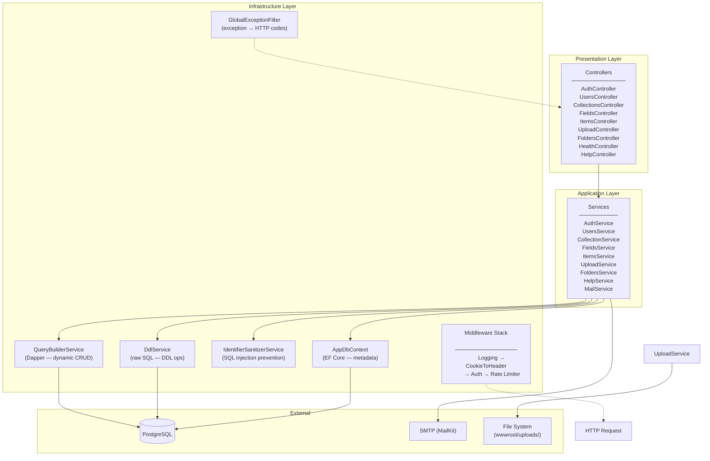

---

## 2. 🧱 Module Map (with file paths)

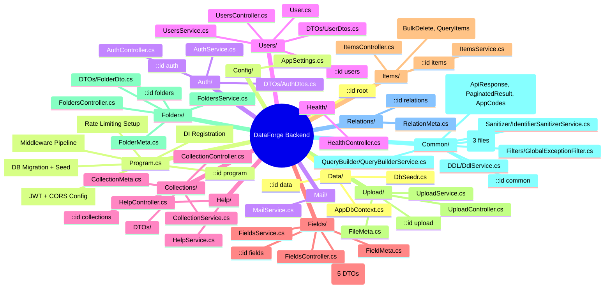

---

## 3. 🔄 Request Lifecycle

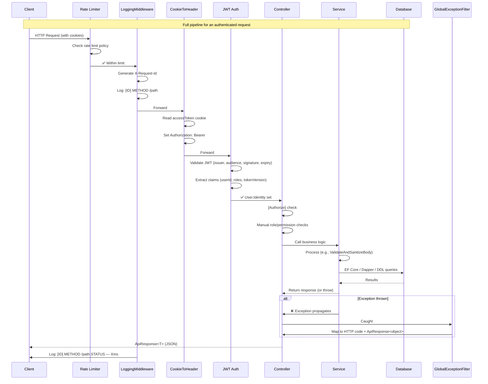

---

## 4. 🔐 Authentication & Authorization Flow

```mermaid
graph TB
    subgraph "Registration"
        A1["POST /auth/register"] --> A2["AuthService.RegisterAsync()"]
        A2 --> A3["Check email uniqueness"]
        A3 --> A4["Create IdentityUser
        (with VerifyToken, expiry=24h)"]
        A4 --> A5["Add to 'User' role"]
        A5 --> A6["Send Welcome email"]
        A6 --> A7["Send Verification email"]
        A7 --> A8["Return success"]
    end

    subgraph "Login"
        B1["POST /auth/login"] --> B2["AuthService.LoginAsync()"]
        B2 --> B3["Find by email"]
        B3 --> B4{"Account locked?"}
        B4 -->|Yes| B5["Return locked message"]
        B4 -->|No| B6{"Email verified?"}
        B6 -->|No| B7["Return verify prompt"]
        B6 -->|Yes| B8{"Password valid?"}
        B8 -->|No| B9["Increment FailedLoginAttempts"]
        B9 --> B10{">= 5 failed?"}
        B10 -->|Yes| B11["Lock 30min"]
        B11 --> B12["Return invalid creds"]
        B10 -->|No| B12
        B8 -->|Yes| B13["Reset FailedLoginAttempts=0"]
        B13 --> B14["Get user roles"]
        B14 --> B15["Generate JWT (15min expiry)
        Claims: NameIdentifier, Email,
        Name, tokenVersion, Role(s)"]
        B15 --> B16["Generate refresh token (32 bytes hex)"]
        B16 --> B17["Store refresh hash via
        SetAuthenticationTokenAsync"]
        B17 --> B18["Set HttpOnly cookies:
        accessToken + refreshToken"]
        B18 --> B19["Return user profile"]
    end

    subgraph "Refresh"
        C1["POST /auth/refresh"] --> C2["AuthService.RefreshAsync()"]
        C2 --> C3["Read refreshToken from cookie"]
        C3 --> C4["Iterate ALL users to match token hash"]
        C4 --> C5["Found?"]
        C5 -->|No| C6["Return invalid token"]
        C5 -->|Yes| C7["Get roles"]
        C7 --> C8["Generate new JWT"]
        C8 --> C9["Set new accessToken cookie"]
    end

    subgraph "Logout"
        D1["POST /auth/logout"] --> D2["AuthService.LogoutAsync()"]
        D2 --> D3["Remove refresh token"]
        D3 --> D4["Increment TokenVersion"]
        D4 --> D5["All existing JWTs invalidated"]
        D5 --> D6["Clear cookies"]
    end
```

### Token Validation Strategy
- **JWT** validates: Issuer, Audience, Lifetime, Signing Key
- **TokenVersion claim** — when user logs out or changes password, version increments → all existing JWTs are invalid
- **CookieToHeaderMiddleware** (`Common/Middleware/CookieToHeaderMiddleware.cs:12-23`) reads `accessToken` cookie → sets `Authorization: Bearer` header
- **Custom 401/403** responses via `JwtBearerEvents` in `Program.cs:133-162`

### Authorization Rules
| Role | Endpoints |
|------|-----------|
| **Admin** | `GET /users`, `DELETE /users/{id}`, `DELETE /upload/{filename}` |
| **Any auth** | All other `[Authorize]` endpoints |
| **Self-or-Admin** | `GET/PATCH /users/{id}` — manually checked in controller (`UsersController.cs:32-38`) |
| **Public** | `/health`, `/auth/register`, `/auth/login`, `/auth/refresh`, `/auth/forgot-password`, `/auth/reset-password`, `/items/*` (no `[Authorize]` attribute but has `ApiKeyMiddleware` commented out) |

### Rate Limiting
| Policy | Limit | Applied To |
|--------|-------|------------|
| **Global** | 100 req/min | All endpoints |
| **Login** | 5 req/min | `/auth/login` specifically |

---

## 5. 🗄️ Data Models & Relationships

```mermaid
erDiagram
    users {
        string Id PK
        string Name
        string Email
        string Avatar
        bool EmailVerified
        string VerifyToken
        datetime VerifyTokenExpiry
        string ResetToken
        datetime ResetTokenExpiry
        int TokenVersion
        int FailedLoginAttempts
        datetime LockedUntil
    }

    collection_metas {
        guid Id PK
        string Name UK
        string TableName UK "col_*"
        bool Singleton
        string PrimaryKey "default: id"
        string PkType "uuid|auto-increment|string"
    }

    field_metas {
        guid Id PK
        guid CollectionId FK
        string Name "snake_case"
        string Label
        string Type "STRING|TEXT|NUMBER|BOOLEAN|DATE|UUID|BIGINT|FLOAT|DECIMAL"
        bool Required
        int SortOrder
        bool Hidden
        bool Readonly
        bool Searchable
        string Width
        string Note
        string Interface "image|..."
        string Options "JSON"
        string DefaultValue
        int MaxLength
        bool IsUnique
        bool IsIndexed
        bool IsSystem
    }

    file_metas {
        guid Id PK
        string filename_disk
        string filename_download
        string title
        string type
        long filesize
        int width
        int height
        guid uploaded_by
        datetime uploaded_on
        guid folder_id FK
    }

    relation_metas {
        guid Id PK
        string many_collection
        string many_field
        string one_collection
        string one_field
    }

    folders {
        guid Id PK
        string name
        guid parent_id FK "self-ref"
        int sort_order
        datetime created_at
    }

    col_* {
        "Dynamic tables created per collection"
    }

    collection_metas ||--o{ field_metas : "has fields"
    folders ||--o{ folders : "parent-child (tree)"
    folders ||--o{ file_metas : "contains files"
    field_metas ..|{ relation_metas : "image fields reference file_metas"
    col_* ..|{ relation_metas : "logical FK reference"

    %% Identity tables (not shown): roles, user_roles, user_claims, user_logins, role_claims, user_tokens
```

### Identity Tables (EF Core managed)
| Table | Notes |
|-------|-------|
| `users` | Extends IdentityUser |
| `roles` | Seeded: Admin, User, Moderator |
| `user_roles` | M2M user→role |
| `user_tokens` | Stores refresh token hash |
| `user_claims`, `role_claims`, `user_logins` | Standard Identity |

### Dynamic Tables (`col_*`)
- Created per collection: `col_{sanitized_name}`
- PK configured: UUID (default), auto-increment (SERIAL), or string (VARCHAR)
- Optional system columns: `status`, `sort`, `created_at`, `created_by`, `updated_at`, `updated_by`
- User-defined columns added via `ALTER TABLE ADD COLUMN`

---

## 6. ⚙️ Dynamic Collections Engine (Core Business Logic)

This is the heart of DataForge — allowing users to create custom data schemas at runtime.

### 6.1 Create Collection Flow

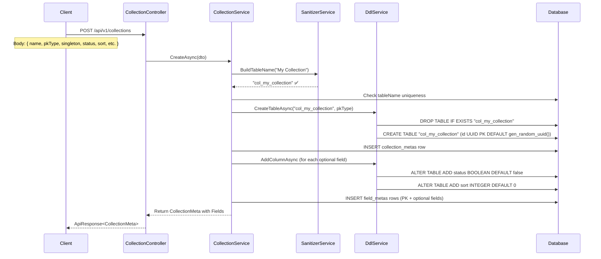

### 6.2 Add Field Flow

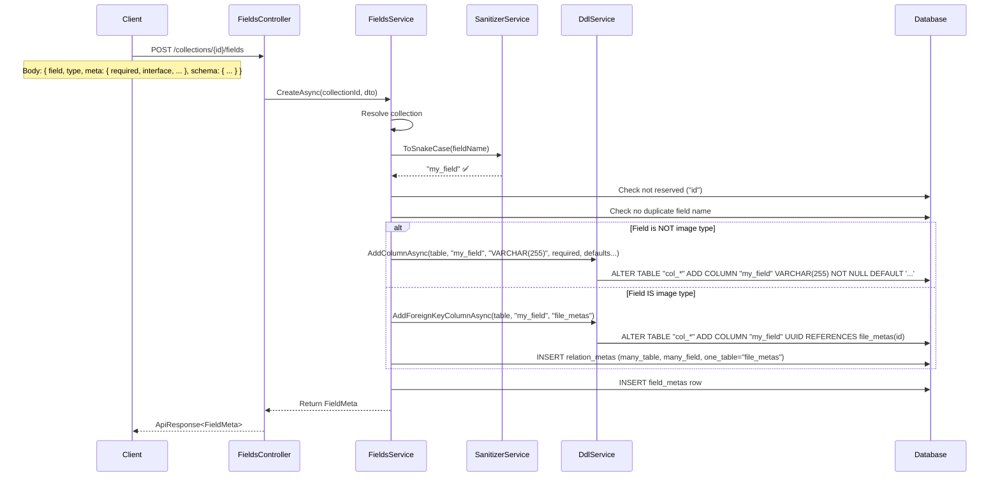

### 6.3 Dynamic CRUD on Items

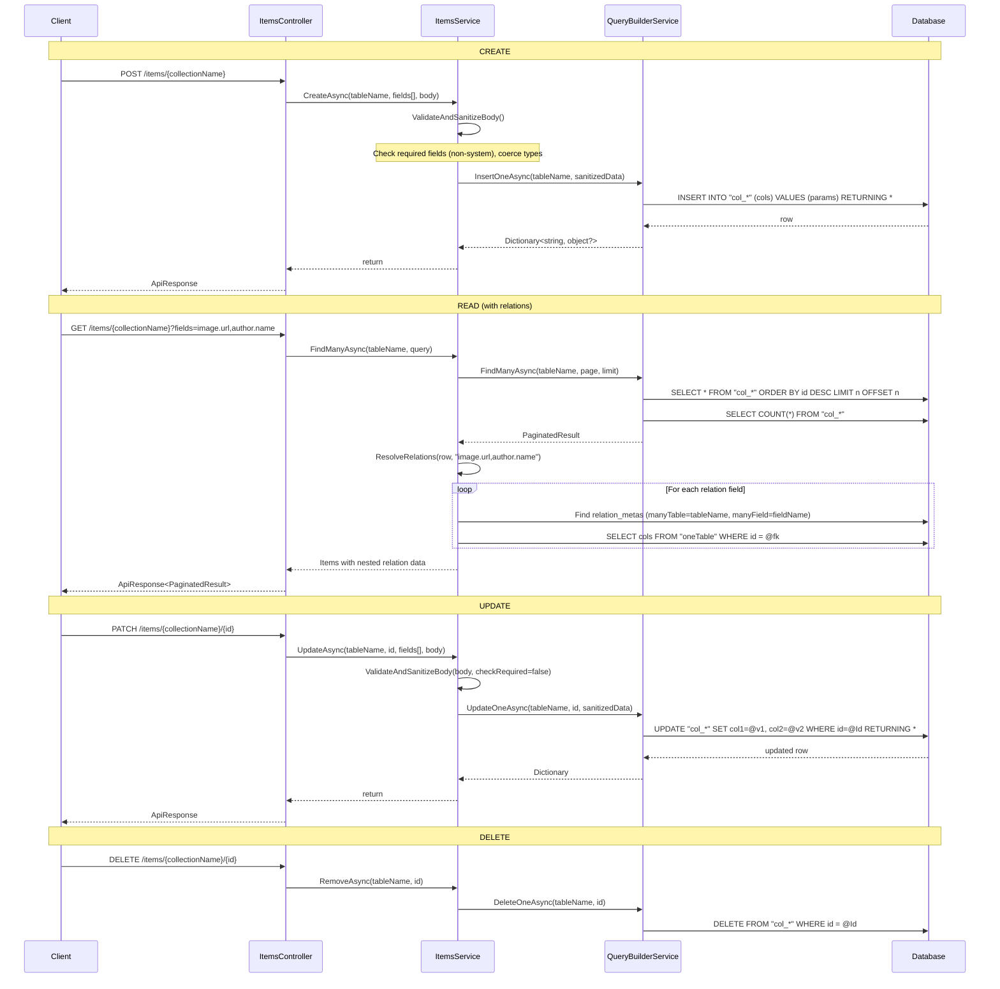

### Type Coercion (ItemsService.cs:166-201)
| FieldType | C# Type | DB Type | Notes |
|-----------|---------|---------|-------|
| STRING | string | VARCHAR(255) | Default |
| TEXT | string | TEXT | |
| NUMBER | Int32 | INTEGER | |
| BIGINT | Int64 | BIGINT | |
| FLOAT / DECIMAL | Decimal | NUMERIC | |
| BOOLEAN | bool | BOOLEAN | |
| DATE | DateOnly | DATE | |
| UUID | Guid | UUID | |

---

## 7. 🧩 Service Dependencies

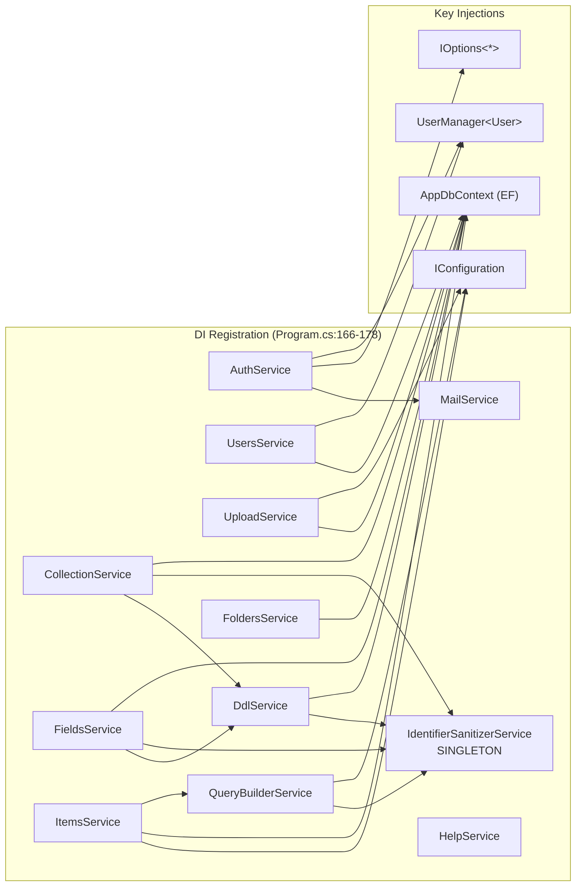

### Service Lifetimes
| Lifetime | Services |
|----------|----------|
| **Singleton** | `IdentifierSanitizerService` — stateless, thread-safe |
| **Scoped** | All other services — per HTTP request |

---

## 8. 🛡️ Middleware Stack (in order)

### Pipeline Order (`Program.cs:211-230`)
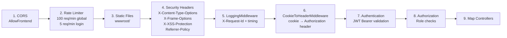

### Middleware Details
| # | Middleware | File | What it does |
|---|-----------|------|--------------|
| 4 | Security Headers | `Program.cs:215-222` (inline) | Adds `nosniff`, `DENY`, `XSS-Protection`, `Referrer-Policy` |
| 5 | Logging | `Common/Middleware/LoggingMiddleware.cs:14-31` | Assigns `X-Request-Id` to each request, logs method/path/status/duration |
| 6 | CookieToHeader | `Common/Middleware/CookieToHeaderMiddleware.cs:12-23` | Reads `accessToken` cookie → `Authorization: Bearer` header |
| 7 | JWT Auth | `Program.cs:113-163` | Validates JWT, custom 401/403 JSON responses |
| — | ApiKeyMiddleware | `Common/Middleware/ApiKeyMiddleware.cs` (commented out) | Optional API key check for `/items` routes |

---

## 9. 📋 All API Endpoints

### Public (no auth)
| Method | Path | File | Purpose |
|--------|------|------|---------|
| GET | `/api/v1/health` | `Health/HealthController.cs` | DB connectivity check |
| POST | `/api/v1/auth/register` | `Auth/AuthController.cs` | Register + send emails |
| POST | `/api/v1/auth/verify-email` | `Auth/AuthController.cs` | Verify token |
| POST | `/api/v1/auth/login` | `Auth/AuthController.cs` | Login (rate limited) |
| POST | `/api/v1/auth/refresh` | `Auth/AuthController.cs` | Refresh JWT |
| POST | `/api/v1/auth/forgot-password` | `Auth/AuthController.cs` | Send reset email |
| POST | `/api/v1/auth/reset-password` | `Auth/AuthController.cs` | Reset with token |
| GET/POST/PATCH/DELETE | `/api/v1/items/{collection}/*` | `Items/ItemsController.cs` | CRUD on dynamic tables (no `[Authorize]` but `ApiKeyMiddleware` commented out) |

### Auth Required
| Method | Path | Controller | Purpose |
|--------|------|------------|---------|
| POST | `/auth/logout` | Auth | Logout |
| POST | `/auth/change-password` | Auth | Change password |
| GET | `/auth/me` | Auth | Current user profile |
| CRUD | `/users` | Users | User management (Admin for list/delete) |
| CRUD | `/collections` | Collections | Dynamic table management |
| CRUD | `/collections/{id}/fields` | Fields | Dynamic field management |
| CRUD | `/upload` | Upload | File/image upload & management |
| CRUD | `/folders` | Folders | Folder tree management |
| GET | `/help/field-types` | Help | Available field types |

---

## 10. 📁 File Upload System

```mermaid
graph TB
    subgraph "Upload Image"
        U1["POST /upload/image"] --> U2["UploadService.UploadImageAsync()"]
        U2 --> U3{"File valid?"}
        U3 -->|"Size > 5MB"| U4["❌ Reject"]
        U3 -->|"Not JPEG/PNG/WEBP/GIF"| U4
        U3 -->|"✅ Valid"| U5["Generate GUID filename"]
        U5 --> U6["Save to wwwroot/uploads/images/{guid}.{ext}"]
        U6 --> U7["INSERT file_metas row"]
        U7 --> U8["Return { id, filename, url, type, filesize }"]
    end

    subgraph "Upload File"
        F1["POST /upload/file"] --> F2["UploadService.UploadFileAsync()"]
        F2 --> F3{"Size > 10MB?"}
        F3 -->|Yes| F4["❌ Reject"]
        F3 -->|No| F5["Generate GUID filename"]
        F5 --> F6["Save to wwwroot/uploads/files/{guid}.{ext}"]
        F6 --> F7["INSERT file_metas row"]
        F7 --> F8["Return file info"]
    end

    subgraph "Organize in Folders"
        FO1["FoldersController"] --> FO2["Hierarchical tree (self-referencing)"]
        FO2 --> FO3["PATCH /upload/files/move → assign folderId"]
    end
```

---

## 11. 📧 Email System (MailService)

| Email Type | Trigger | Template Content |
|------------|---------|-----------------|
| **Welcome** | Register | Greeting + app name |
| **Email Verification** | Register | Link: `{frontendUrl}/verify-email?token={token}&email={email}` |
| **Password Reset** | Forgot Password | Link: `{frontendUrl}/reset-password?token={token}&email={email}` |

**Config:** Gmail SMTP via `appsettings.json` → `MailSettings` (`Mail/MailService.cs:21-36`)

---

## 12. ⚠️ Error Handling Strategy

### GlobalExceptionFilter (`Common/Filters/GlobalExceptionFilter.cs:17-36`)

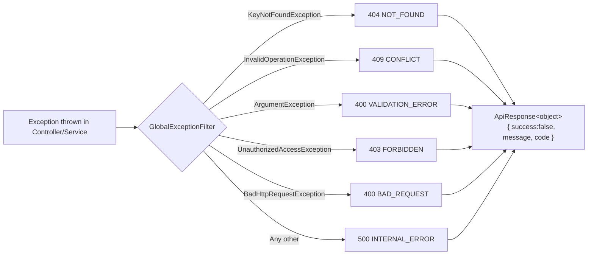

### Unified Response Format (`Common/Models/ApiResponse.cs`)
```json
{
  "success": true,
  "message": "Operation successful",
  "code": "SUCCESS",
  "data": { ... }
}
```

---

## 13. 🔧 Configuration

| Config Section | File | Key Values |
|---------------|------|------------|
| ConnectionStrings | `appsettings.json` | PostgreSQL: `Host=localhost;Database=DataForgeDB;...` |
| JwtSettings | `appsettings.json` | Secret (32+ chars), Issuer, Audience, AccessTokenExpiryMinutes=15, RefreshTokenExpiryDays=7 |
| CorsSettings | `appsettings.json` | AllowedOrigins: `http://localhost:3000,http://localhost:5173` |
| MailSettings | `appsettings.json` | Gmail SMTP host/port/credentials |
| RateLimiting | `appsettings.json` | PermitLimit=100, WindowMinutes=1 |
| App | `appsettings.json` | ApiKey, FrontendUrl |

---

## 14. 📌 Key Files Quick Reference

| File | Lines | Why It Matters |
|------|-------|---------------|
| `Program.cs:33-202` | 170 | Full DI + middleware + config setup |
| `Program.cs:211-230` | 20 | Middleware pipeline order |
| `Auth/AuthService.cs:90-148` | 59 | Login with lockout + JWT issuance |
| `Auth/AuthService.cs:255-279` | 25 | JWT generation with claims |
| `Collections/CollectionService.cs:23-76` | 54 | Collection creation → DDL + metadata |
| `Fields/FieldsService.cs:27-106` | 80 | Field creation → DDL + relation (if image) |
| `Fields/FieldMeta.cs:30-113` | 84 | FieldType → DB type mapping schema |
| `Items/ItemsService.cs:203-232` | 30 | Body validation + type coercion |
| `Items/ItemsService.cs:88-132` | 45 | Relation resolution (nested field querying) |
| `Common/QueryBuilder/QueryBuilderService.cs:21-50` | 30 | Dapper SELECT with pagination |
| `Common/DDL/DdlService.cs:18-35` | 18 | Dynamic CREATE TABLE |
| `Common/DDL/DdlService.cs:37-105` | 69 | Dynamic ADD COLUMN with type conversion |
| `Common/Middleware/CookieToHeaderMiddleware.cs:12-23` | 12 | Cookie → Bearer token bridge |
| `Common/Sanitizer/IdentifierSanitizerService.cs:15-23` | 9 | SQL injection prevention |
| `Data/AppDbContext.cs:23-118` | 96 | Fluent API entity configuration |
| `Data/DbSeedr.cs:8-38` | 31 | Seeds roles + admin user |

---

## 15. 🧪 Development Setup

### Prerequisites
- .NET 8 SDK
- PostgreSQL running on localhost:5432
- Gmail app password (for email)

### Quick Start
```bash
cd backend
# Update connection string in appsettings.json
dotnet run
# Opens Swagger at /swagger on dev
```

### Seed Data
- Roles: Admin, User, Moderator
- Admin user: `admin@starter.com` / `Admin@123456`
- Auto-migrate + seed on every startup (`Program.cs:233-239`)

---

## 16. 🔮 Patterns & Conventions

| Pattern | Convention |
|---------|-----------|
| **Response format** | All endpoints return `ApiResponse<T>` with success/message/code/data |
| **Exception propagation** | Services throw C# exceptions → GlobalExceptionFilter catches and maps to HTTP codes |
| **Dynamic SQL safety** | All identifiers pass through `IdentifierSanitizerService` before raw SQL |
| **Auth** | Cookie-based JWT (HttpOnly) + role-based `[Authorize]` + manual self-or-admin checks |
| **Module structure** | `{ModuleName}/` → Controller.cs, Service.cs, Model.cs, DTOs/ |
| **DI registration** | Manual in `Program.cs:166-178` (no reflection/scanning) |
| **Table naming** | Dynamic tables: `col_{name}`, metadata: `{entity}_metas`, Identity: standard lowercase |
| **API versioning** | `api/v1/` via Asp.Versioning.Mvc |
